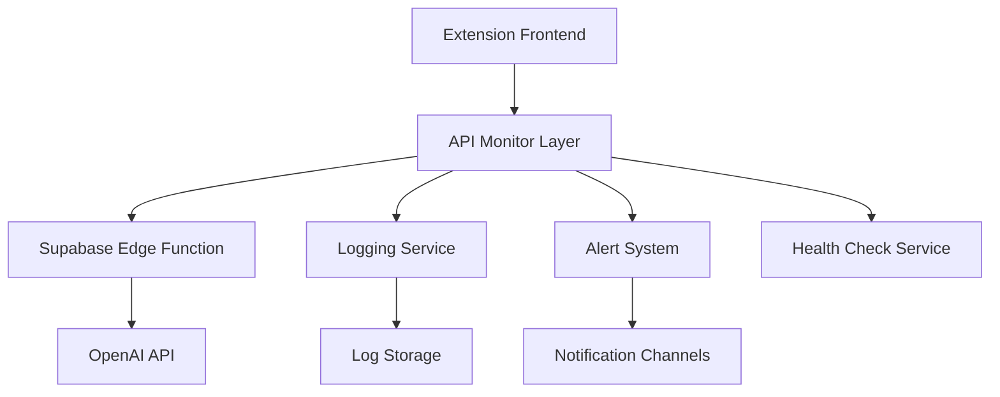

# Design Document - Sistema de Monitoramento de API

## Overview

O sistema de monitoramento será implementado como uma camada de observabilidade que intercepta e monitora todas as interações com a API da OpenAI, fornecendo logs detalhados, alertas proativos e ferramentas de diagnóstico para garantir alta disponibilidade da extensão LEX.

## Architecture

### Componentes Principais



### Fluxo de Monitoramento

1. **Interceptação**: Todas as requisições passam pelo API Monitor Layer
2. **Logging**: Cada requisição/resposta é registrada com metadados
3. **Análise**: Sistema analisa padrões de erro em tempo real
4. **Alertas**: Dispara notificações baseadas em regras configuradas
5. **Diagnóstico**: Ferramentas automáticas testam conectividade

## Components and Interfaces

### 1. API Monitor Layer
```javascript
class APIMonitor {
  async interceptRequest(request) {
    // Log request details
    // Start timing
    // Forward to API
    // Log response
    // Analyze for errors
    // Trigger alerts if needed
  }
  
  async logInteraction(requestData, responseData, timing) {
    // Store in Supabase logs table
  }
  
  async analyzeHealthStatus() {
    // Check recent error rates
    // Validate API key status
    // Return health metrics
  }
}
```

### 2. Logging Service
```javascript
class LoggingService {
  async logAPICall(data) {
    // Structure: timestamp, request_id, method, status, response_time, tokens_used, error_details
  }
  
  async getRecentLogs(timeframe) {
    // Retrieve logs for dashboard
  }
  
  async rotateOldLogs() {
    // Clean up logs older than retention period
  }
}
```

### 3. Alert System
```javascript
class AlertSystem {
  async checkAlertConditions() {
    // Monitor error rates
    // Check API key validity
    // Detect service outages
  }
  
  async sendAlert(type, message, severity) {
    // Send via configured channels (email, webhook, etc.)
  }
}
```

### 4. Health Check Service
```javascript
class HealthCheckService {
  async performDiagnostics() {
    // Test API connectivity
    // Validate API key
    // Check environment variables
    // Return diagnostic report
  }
}
```

## Data Models

### Log Entry
```sql
CREATE TABLE api_logs (
  id UUID PRIMARY KEY DEFAULT gen_random_uuid(),
  timestamp TIMESTAMPTZ DEFAULT NOW(),
  request_id VARCHAR(50),
  method VARCHAR(10),
  endpoint VARCHAR(200),
  status_code INTEGER,
  response_time_ms INTEGER,
  tokens_used INTEGER,
  model_used VARCHAR(50),
  error_message TEXT,
  error_code VARCHAR(50),
  user_agent TEXT,
  created_at TIMESTAMPTZ DEFAULT NOW()
);
```

### Alert Configuration
```sql
CREATE TABLE alert_rules (
  id UUID PRIMARY KEY DEFAULT gen_random_uuid(),
  name VARCHAR(100),
  condition_type VARCHAR(50), -- 'error_rate', 'api_key_invalid', 'service_down'
  threshold_value DECIMAL,
  time_window_minutes INTEGER,
  severity VARCHAR(20), -- 'low', 'medium', 'high', 'critical'
  notification_channels JSONB,
  is_active BOOLEAN DEFAULT true,
  created_at TIMESTAMPTZ DEFAULT NOW()
);
```

### Health Status
```sql
CREATE TABLE health_status (
  id UUID PRIMARY KEY DEFAULT gen_random_uuid(),
  timestamp TIMESTAMPTZ DEFAULT NOW(),
  api_status VARCHAR(20), -- 'healthy', 'degraded', 'down'
  api_key_valid BOOLEAN,
  last_successful_call TIMESTAMPTZ,
  error_rate_1h DECIMAL,
  error_rate_24h DECIMAL,
  avg_response_time_ms INTEGER,
  total_calls_24h INTEGER,
  created_at TIMESTAMPTZ DEFAULT NOW()
);
```

## Error Handling

### Error Classification
1. **API Key Errors** (401, invalid_api_key)
2. **Rate Limit Errors** (429)
3. **Service Errors** (500, 502, 503)
4. **Network Errors** (timeout, connection refused)
5. **Unknown Errors** (outros códigos)

### Error Response Strategy
```javascript
const ERROR_MESSAGES = {
  'invalid_api_key': 'API key inválida - contate o administrador',
  'rate_limit': 'Muitas requisições - aguarde um momento',
  'service_unavailable': 'Serviço temporariamente indisponível',
  'network_error': 'Problema de conexão - tente novamente',
  'unknown': 'Erro inesperado - código: {error_code}'
};
```

## Testing Strategy

### Unit Tests
- Testar interceptação de requisições
- Validar logging de dados
- Verificar lógica de alertas
- Testar classificação de erros

### Integration Tests
- Testar fluxo completo de monitoramento
- Validar integração com Supabase
- Testar envio de alertas
- Verificar diagnósticos automáticos

### End-to-End Tests
- Simular cenários de API key inválida
- Testar recuperação de falhas
- Validar experiência do usuário com erros
- Testar dashboard de monitoramento

## Implementation Phases

### Phase 1: Core Monitoring
- Implementar API Monitor Layer
- Criar logging básico
- Configurar storage no Supabase

### Phase 2: Error Detection
- Implementar classificação de erros
- Criar sistema de alertas básico
- Adicionar health checks

### Phase 3: Dashboard & Diagnostics
- Criar interface de monitoramento
- Implementar ferramentas de diagnóstico
- Adicionar métricas avançadas

### Phase 4: Advanced Features
- Configurar alertas por email/webhook
- Implementar rotação automática de logs
- Adicionar analytics avançados