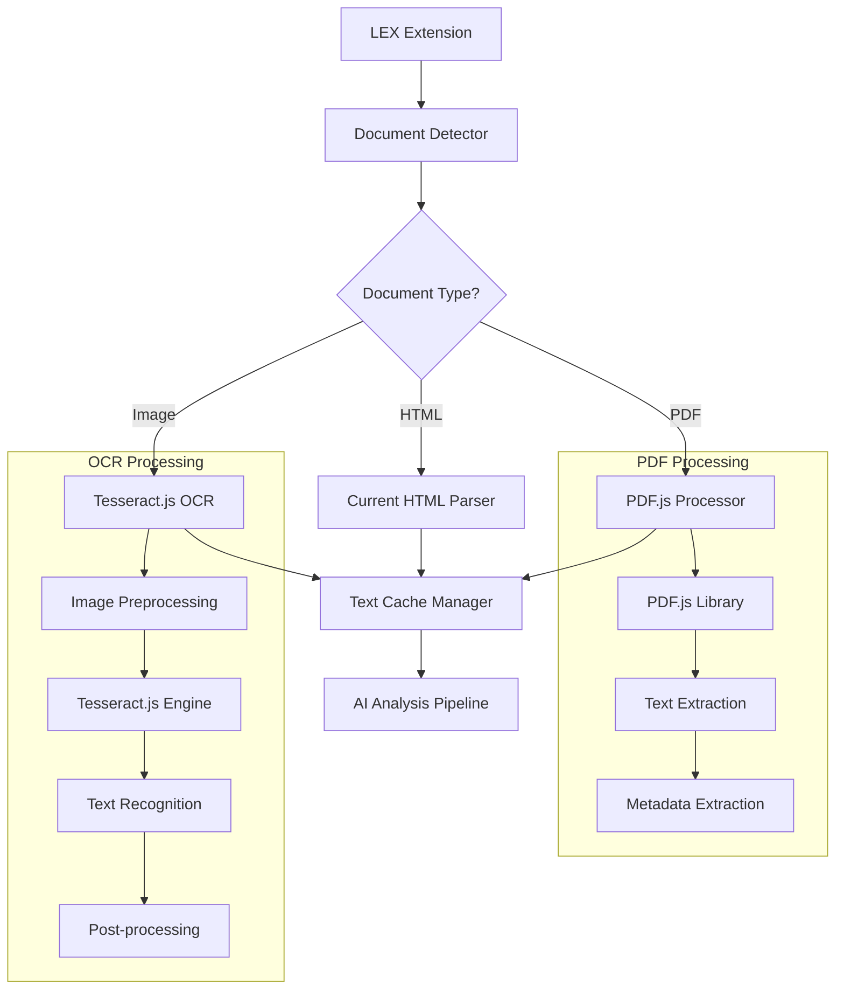

# Design Document - Sistema de Leitura de PDFs e OCR

## Overview

O sistema expandirá as capacidades da LEX para processar PDFs e imagens escaneadas usando PDF.js e Tesseract.js, mantendo todo o processamento local no browser para garantir privacidade e performance, sem custos adicionais de APIs externas.

## Architecture

### Componentes Principais



### Fluxo de Processamento

1. **Detecção**: Sistema identifica tipo de documento no iframe
2. **Roteamento**: Escolhe processador apropriado (PDF.js ou Tesseract.js)
3. **Processamento**: Extrai texto usando biblioteca específica
4. **Cache**: Armazena resultado para evitar reprocessamento
5. **Análise**: Envia texto extraído para pipeline de IA

## Components and Interfaces

### 1. Document Detector
```javascript
class DocumentDetector {
  static detectDocumentType(url, contentType) {
    if (contentType.includes('application/pdf') || url.includes('.pdf')) {
      return 'PDF';
    }
    if (contentType.includes('image/') || /\.(jpg|jpeg|png|tiff|bmp)$/i.test(url)) {
      return 'IMAGE';
    }
    return 'HTML';
  }
  
  static async getDocumentBlob(url) {
    const response = await fetch(url, { credentials: 'include' });
    return await response.blob();
  }
}
```

### 2. PDF Processor (PDF.js)
```javascript
class PDFProcessor {
  constructor() {
    this.pdfjsLib = null;
    this.initialized = false;
  }
  
  async initialize() {
    if (!this.initialized) {
      // Carregar PDF.js via CDN ou local
      await this.loadPDFJS();
      this.initialized = true;
    }
  }
  
  async extractTextFromPDF(pdfBlob) {
    await this.initialize();
    
    const arrayBuffer = await pdfBlob.arrayBuffer();
    const pdf = await this.pdfjsLib.getDocument(arrayBuffer).promise;
    
    let fullText = '';
    const metadata = await pdf.getMetadata();
    
    // Extrair texto de todas as páginas
    for (let i = 1; i <= pdf.numPages; i++) {
      const page = await pdf.getPage(i);
      const textContent = await page.getTextContent();
      const pageText = textContent.items.map(item => item.str).join(' ');
      fullText += `\n--- Página ${i} ---\n${pageText}\n`;
    }
    
    return {
      text: fullText.trim(),
      pages: pdf.numPages,
      metadata: metadata.info,
      title: metadata.info?.Title || 'Documento PDF'
    };
  }
  
  async loadPDFJS() {
    // Carregar PDF.js
    const script = document.createElement('script');
    script.src = 'https://cdnjs.cloudflare.com/ajax/libs/pdf.js/3.11.174/pdf.min.js';
    document.head.appendChild(script);
    
    return new Promise((resolve) => {
      script.onload = () => {
        this.pdfjsLib = window.pdfjsLib;
        this.pdfjsLib.GlobalWorkerOptions.workerSrc = 
          'https://cdnjs.cloudflare.com/ajax/libs/pdf.js/3.11.174/pdf.worker.min.js';
        resolve();
      };
    });
  }
}
```

### 3. OCR Processor (Tesseract.js)
```javascript
class OCRProcessor {
  constructor() {
    this.tesseract = null;
    this.worker = null;
    this.initialized = false;
  }
  
  async initialize() {
    if (!this.initialized) {
      await this.loadTesseract();
      this.worker = await this.tesseract.createWorker('por', 1, {
        logger: m => console.log('OCR:', m)
      });
      
      // Configurações otimizadas para documentos jurídicos
      await this.worker.setParameters({
        tessedit_char_whitelist: 'ABCDEFGHIJKLMNOPQRSTUVWXYZabcdefghijklmnopqrstuvwxyzÀÁÂÃÄÅÇÈÉÊËÌÍÎÏÑÒÓÔÕÖÙÚÛÜÝàáâãäåçèéêëìíîïñòóôõöùúûüý0123456789.,;:!?()[]{}/-°ª º',
        tessedit_pageseg_mode: '1', // Automatic page segmentation with OSD
        preserve_interword_spaces: '1'
      });
      
      this.initialized = true;
    }
  }
  
  async extractTextFromImage(imageBlob) {
    await this.initialize();
    
    // Pré-processamento da imagem
    const processedImage = await this.preprocessImage(imageBlob);
    
    // OCR
    const { data: { text, confidence } } = await this.worker.recognize(processedImage);
    
    // Pós-processamento
    const cleanedText = this.postProcessText(text);
    
    return {
      text: cleanedText,
      confidence: confidence,
      originalText: text,
      processed: true
    };
  }
  
  async preprocessImage(imageBlob) {
    // Converter para canvas para pré-processamento
    const canvas = document.createElement('canvas');
    const ctx = canvas.getContext('2d');
    const img = new Image();
    
    return new Promise((resolve) => {
      img.onload = () => {
        canvas.width = img.width;
        canvas.height = img.height;
        
        // Desenhar imagem
        ctx.drawImage(img, 0, 0);
        
        // Aplicar filtros para melhorar OCR
        const imageData = ctx.getImageData(0, 0, canvas.width, canvas.height);
        
        // Aumentar contraste e brilho
        this.enhanceContrast(imageData);
        
        ctx.putImageData(imageData, 0, 0);
        resolve(canvas);
      };
      
      img.src = URL.createObjectURL(imageBlob);
    });
  }
  
  enhanceContrast(imageData) {
    const data = imageData.data;
    const contrast = 1.5;
    const brightness = 10;
    
    for (let i = 0; i < data.length; i += 4) {
      // Aplicar contraste e brilho
      data[i] = Math.min(255, Math.max(0, contrast * (data[i] - 128) + 128 + brightness));     // R
      data[i + 1] = Math.min(255, Math.max(0, contrast * (data[i + 1] - 128) + 128 + brightness)); // G
      data[i + 2] = Math.min(255, Math.max(0, contrast * (data[i + 2] - 128) + 128 + brightness)); // B
    }
  }
  
  postProcessText(text) {
    return text
      .replace(/\s+/g, ' ') // Múltiplos espaços
      .replace(/([a-z])([A-Z])/g, '$1 $2') // Separar palavras grudadas
      .replace(/(\d)([A-Za-z])/g, '$1 $2') // Separar números de letras
      .replace(/([A-Za-z])(\d)/g, '$1 $2')
      .trim();
  }
  
  async loadTesseract() {
    const script = document.createElement('script');
    script.src = 'https://unpkg.com/tesseract.js@4/dist/tesseract.min.js';
    document.head.appendChild(script);
    
    return new Promise((resolve) => {
      script.onload = () => {
        this.tesseract = window.Tesseract;
        resolve();
      };
    });
  }
  
  async terminate() {
    if (this.worker) {
      await this.worker.terminate();
      this.worker = null;
      this.initialized = false;
    }
  }
}
```

### 4. Enhanced Document Extractor
```javascript
class EnhancedDocumentExtractor {
  constructor() {
    this.pdfProcessor = new PDFProcessor();
    this.ocrProcessor = new OCRProcessor();
    this.cache = new Map();
  }
  
  async extractDocumentContent(url, contentType) {
    // Verificar cache primeiro
    const cacheKey = this.generateCacheKey(url);
    if (this.cache.has(cacheKey)) {
      console.log('📋 LEX: Usando documento do cache');
      return this.cache.get(cacheKey);
    }
    
    const documentType = DocumentDetector.detectDocumentType(url, contentType);
    console.log('📄 LEX: Tipo de documento detectado:', documentType);
    
    let result;
    
    try {
      switch (documentType) {
        case 'PDF':
          result = await this.processPDF(url);
          break;
        case 'IMAGE':
          result = await this.processImage(url);
          break;
        default:
          result = await this.processHTML(url);
      }
      
      // Armazenar no cache
      this.cache.set(cacheKey, result);
      this.cleanupCache();
      
      return result;
      
    } catch (error) {
      console.error('❌ LEX: Erro ao processar documento:', error);
      return {
        text: '[Erro ao processar documento]',
        type: documentType,
        error: error.message
      };
    }
  }
  
  async processPDF(url) {
    console.log('📄 LEX: Processando PDF...');
    const blob = await DocumentDetector.getDocumentBlob(url);
    const result = await this.pdfProcessor.extractTextFromPDF(blob);
    
    return {
      text: result.text,
      type: 'PDF',
      pages: result.pages,
      metadata: result.metadata,
      title: result.title,
      url: url
    };
  }
  
  async processImage(url) {
    console.log('🖼️ LEX: Processando imagem com OCR...');
    const blob = await DocumentDetector.getDocumentBlob(url);
    const result = await this.ocrProcessor.extractTextFromImage(blob);
    
    return {
      text: result.text,
      type: 'IMAGE',
      confidence: result.confidence,
      originalText: result.originalText,
      url: url
    };
  }
  
  async processHTML(url) {
    // Usar método atual para HTML
    const response = await fetch(url, { credentials: 'include' });
    const html = await response.text();
    const text = this.extractTextFromHTML(html);
    
    return {
      text: text,
      type: 'HTML',
      url: url
    };
  }
  
  extractTextFromHTML(html) {
    const tempDiv = document.createElement('div');
    tempDiv.innerHTML = html;
    
    const scripts = tempDiv.querySelectorAll('script, style, noscript');
    scripts.forEach(el => el.remove());
    
    return tempDiv.innerText || tempDiv.textContent || '';
  }
  
  generateCacheKey(url) {
    return btoa(url).replace(/[^a-zA-Z0-9]/g, '').substring(0, 32);
  }
  
  cleanupCache() {
    if (this.cache.size > 50) {
      const firstKey = this.cache.keys().next().value;
      this.cache.delete(firstKey);
    }
  }
}
```

## Integration Steps

### 1. Manifest.json Updates
```json
{
  "permissions": [
    "activeTab",
    "storage",
    "https://*/*"
  ],
  "content_security_policy": {
    "extension_pages": "script-src 'self' https://cdnjs.cloudflare.com https://unpkg.com; object-src 'self'"
  }
}
```

### 2. Content Script Integration
```javascript
// Substituir função atual
async function extrairConteudoDocumento() {
  const extractor = new EnhancedDocumentExtractor();
  
  const iframe = document.querySelector('iframe[src*="/documento/"]');
  if (!iframe) return null;
  
  const url = iframe.src;
  const contentType = await getContentType(url);
  
  return await extractor.extractDocumentContent(url, contentType);
}

async function getContentType(url) {
  try {
    const response = await fetch(url, { 
      method: 'HEAD', 
      credentials: 'include' 
    });
    return response.headers.get('content-type') || '';
  } catch {
    return '';
  }
}
```

## Error Handling

### PDF Processing Errors
- Arquivo corrompido
- PDF protegido por senha
- Arquivo muito grande
- Erro de memória

### OCR Processing Errors
- Imagem ilegível
- Formato não suportado
- Timeout de processamento
- Baixa confiança do OCR

## Performance Considerations

### Loading Strategy
- Carregar bibliotecas sob demanda
- Usar Web Workers para processamento pesado
- Implementar timeout para operações longas

### Memory Management
- Limpar workers após uso
- Cache com limite de tamanho
- Garbage collection de objetos grandes

## Testing Strategy

### Unit Tests
- Testar cada processador individualmente
- Validar cache e cleanup
- Testar detecção de tipos

### Integration Tests
- Testar fluxo completo com documentos reais
- Validar performance com arquivos grandes
- Testar recuperação de erros

### End-to-End Tests
- Testar no PJe com documentos variados
- Validar experiência do usuário
- Testar em diferentes browsers