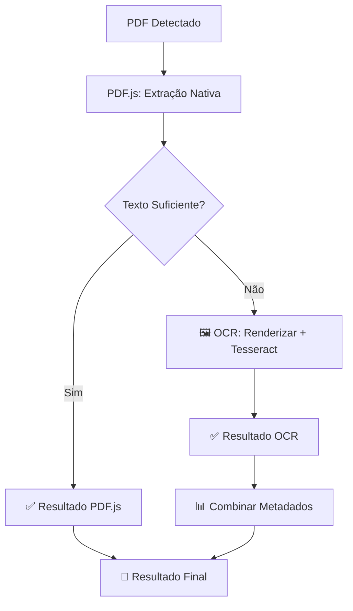

# 🔍 Sistema Híbrido PDF.js + OCR

## 📋 Overview

O LEX agora suporta **extração híbrida de texto**, combinando:
- **PDF.js** para PDFs com texto nativo (rápido)
- **Tesseract.js OCR** para PDFs escaneados (inteligente)

### ✨ **Funcionamento Inteligente**



## 🚀 **Novos Recursos Implementados**

### **1. Detecção Inteligente**
- ✅ Analisa quantidade de texto extraído
- ✅ Detecta PDFs escaneados automaticamente
- ✅ Critérios: mínimo 50 caracteres, 5 palavras, 10 chars/página

### **2. OCR Avançado**
- ✅ **Tesseract.js** local (Manifest V3 compliant)
- ✅ **Português jurídico** otimizado
- ✅ **Pré-processamento** de imagem (contraste, gamma)
- ✅ **Pós-processamento** de texto (limpeza, correções)

### **3. Renderização PDF→Canvas**
- ✅ **PDF.js render()** para gerar imagens
- ✅ **Qualidade configurável** (1x, 2x, 3x)
- ✅ **Fundo branco** para melhor OCR
- ✅ **Escala otimizada** por página

### **4. Processamento Híbrido**
- ✅ **Fallback robusto**: OCR → PDF nativo → Erro
- ✅ **Progress callbacks** com método usado
- ✅ **Métricas detalhadas** (confiança, tempo, método)
- ✅ **Cleanup automático** de recursos

## 📁 **Arquivos Adicionados**

### **Bibliotecas (Local - Manifest V3)**
```
src/js/tesseract.min.js        # 67KB  - Biblioteca principal
src/js/tesseract-worker.min.js # 123KB - Worker
src/js/por.traineddata         # 15MB  - Dados português
```

### **Código Novo**
```
src/js/ocr-processor.js        # Classe OCRProcessor
src/js/pdf-processor.js        # Métodos híbridos adicionados
```

### **Configurações**
```json
// manifest.json - Atualizado
"content_scripts": [
  "src/js/tesseract.min.js",
  "src/js/ocr-processor.js"
],
"web_accessible_resources": [
  "src/js/tesseract-worker.min.js",
  "src/js/por.traineddata"
]
```

## 🔧 **API - Como Usar**

### **1. Extração Híbrida (Recomendado)**
```javascript
const processor = new PDFProcessor();
await processor.initialize();

const result = await processor.extractTextHybrid(pdfBlob, {
  // Configurações PDF
  includeMetadata: true,
  includePageNumbers: true,
  maxPages: 20,
  
  // Configurações OCR
  ocrFallback: true,           // Usar OCR se texto nativo insuficiente
  minTextThreshold: 50,        // Mínimo de chars para considerar sucesso
  ocrQuality: 2,               // 1=rápido, 2=balanceado, 3=qualidade
  
  // Callback de progresso
  progressCallback: (progress) => {
    console.log(`${progress.method}: ${progress.progress}%`);
  }
});

// Resultado
console.log('Método usado:', result.extractionMethod); // 'native_text' ou 'ocr'
console.log('OCR usado:', result.ocrUsed);              // true/false
console.log('PDF escaneado:', result.scannedPdfDetected); // true/false
console.log('Confiança OCR:', result.stats.averageConfidence); // 0-100%
```

### **2. OCR Direto (Para Imagens)**
```javascript
const ocrProcessor = new OCRProcessor();
await ocrProcessor.initialize();

const result = await ocrProcessor.extractTextFromImage(imageSource, {
  preprocess: true,        // Pré-processar imagem
  enhanceContrast: true,   // Melhorar contraste
  minConfidence: 30        // Confiança mínima
});
```

## 📊 **Métricas e Monitoramento**

### **Logs Console**
```
📄 LEX: Extraindo texto do PDF com OCR híbrido...
📊 LEX: Análise de texto nativo:
- Caracteres: 45
- Palavras: 8
- Páginas: 2
- Ratio chars/página: 22
- Texto suficiente: false
🖼️ LEX: PDF escaneado detectado, iniciando extração OCR...
🖼️ LEX: OCR página 1/2...
🔍 LEX: OCR 85%
✅ LEX: OCR do PDF concluído
- Páginas processadas: 2
- Páginas com sucesso: 2
- Confiança média: 87%
- Tempo total: 12s
✅ LEX: PDF processado com sucesso
- Método usado: ocr
- OCR utilizado: Sim
- PDF escaneado detectado: true
- Confiança OCR: 87%
```

## ⚡ **Performance**

### **Tempos Esperados**
- **PDF Nativo**: 100-500ms por página
- **OCR Qualidade 1**: 2-5s por página
- **OCR Qualidade 2**: 5-10s por página  
- **OCR Qualidade 3**: 10-20s por página

### **Tamanhos**
- **Extensão**: +15.2MB (principalmente por.traineddata)
- **Memória**: +50-100MB durante OCR
- **Processamento**: CPU intensivo durante OCR

## 🛡️ **Tratamento de Erros**

### **Fallbacks Implementados**
1. **OCR falha** → Usar texto nativo (mesmo se pouco)
2. **Tesseract não carrega** → PDF.js apenas
3. **Canvas rendering falha** → Página ignorada
4. **Timeout OCR** → Próxima página

### **Logs de Erro**
```javascript
❌ LEX: OCRProcessor não disponível
🔄 LEX: Usando resultado de texto nativo como fallback
⚠️ LEX: Erro OCR na página 3: Timeout exceeded
```

## 🧪 **Como Testar**

### **1. PDF Normal (Texto Nativo)**
- Usar qualquer PDF com texto copiável
- Deve usar `extractionMethod: 'native_text'`
- Deve ser rápido (< 1s)

### **2. PDF Escaneado**
- Usar PDF de documento digitalizado/scaneado
- Deve detectar `scannedPdfDetected: true`
- Deve usar `extractionMethod: 'ocr'`
- Deve demorar mais (5-20s)

### **3. Console do Browser**
- Abrir DevTools → Console
- Carregar documento no PJe
- Usar LEX para analisar
- Verificar logs detalhados

## 🔄 **Próximos Passos**

### **Melhorias Planejadas**
- [ ] **Cache OCR**: Evitar reprocessar mesma página
- [ ] **OCR Web Workers**: Não bloquear UI
- [ ] **Qualidade adaptativa**: Ajustar baseado no resultado
- [ ] **Pré-processamento avançado**: Deskew, noise reduction
- [ ] **Configurações por usuário**: Qualidade, timeout customizáveis

### **Otimizações**
- [ ] **Lazy loading**: Carregar Tesseract apenas quando necessário
- [ ] **Compressão**: Reduzir tamanho do por.traineddata
- [ ] **Streaming**: Processar páginas em paralelo
- [ ] **Memory management**: Cleanup mais agressivo

## 🎯 **Status Atual**

### ✅ **Implementado**
- [x] Sistema híbrido PDF.js + OCR
- [x] Detecção automática de PDFs escaneados
- [x] Renderização PDF para Canvas
- [x] OCR com Tesseract.js português
- [x] Pré/pós-processamento de texto
- [x] Métricas e logs detalhados
- [x] Fallbacks robustos
- [x] Manifest V3 compliance

### 🔄 **Em Teste**
- [ ] Performance com PDFs grandes
- [ ] Qualidade OCR em diferentes tipos de documento
- [ ] Estabilidade com uso prolongado
- [ ] Compatibilidade entre navegadores

---

**🎉 A LEX agora pode ler qualquer documento PDF, mesmo os escaneados!** 

*Os documentos jurídicos digitalizados do PJe finalmente serão compreendidos pela IA.* ⚖️🤖